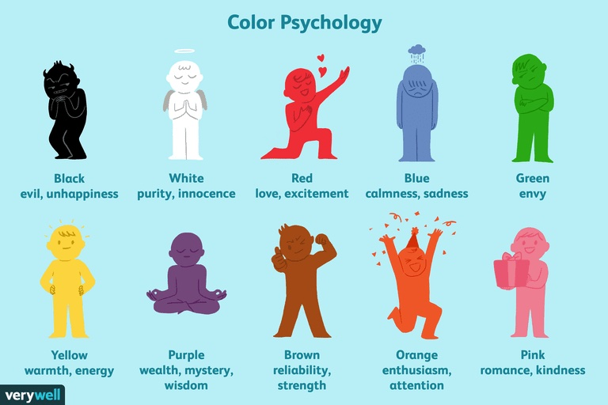

# websites
(draft)

- cms vs static
## WordPress
### On Wordpress.com
- use with '.wordpress.com' extension (free)
- use with custom domain (without '.wordpess.com' extension) (paid)
### On your selected hosting
- download/install (more control)
## GitHub Pages
- turn repository into GitHub Pages

+ CV (and LinkedIn)
- keep it simple (formatting as well)
  - will need to rewrite your CV for different jobs

- make website future proof
- succinct
- use variables as much as possible (it will help change your design if needed)

- correct use of headings

## learn news skills vs asking someone else to do it
- the actual website's frame
- images/logos 
- music/sound
- learn, pay or perhaps use free assets

### events
#### upcoming events
- write content that is easy to change 

## design
from https://www.verywellmind.com/color-psychology-2795824:

1. Other people, first and foremost. We have a natural ability to detect fakeness (as well as a limited tolerance for it : https://tvtropes.org/pmwiki/pmwiki.php/Main/UncannyValley), and are naturally drawn to other real human faces feeling real emotions (as opposed to staged stock photos). It’s how we’ve evolved.
2. Color. Yes, there is a science behind it (https://www.verywellmind.com/color-psychology-2795824)
3. Layout. The image that seems cozy and compact to some might be seen as dark and crowded to others. Light space is better, as it allows “room to breathe.”
4. Contributory factors like image quality and font type and size.

## resources
- https://marksheet.io/introduction.html
- https://www.flatfilecmslist.com/
- https://developers.google.com/web/fundamentals/
- http://sivel.net/ (Wordpress maintenance)
- https://devhints.io/jekyll

## things
- hidden files need uploading as well
- sometimes browser doesn’t refresh (try another or clean);

## other
- make our own website to have control over our data
- OpenGraphs/SEO
- shall I direct trafic from my social media to my own website, why?
- archive.org to see old websites
