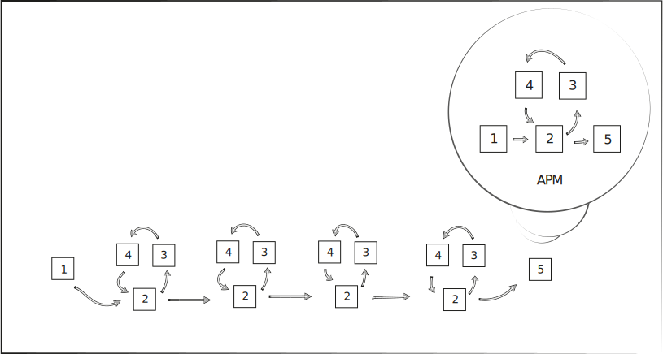
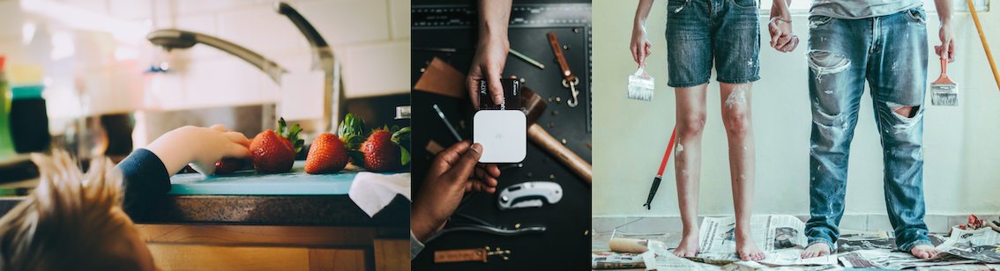
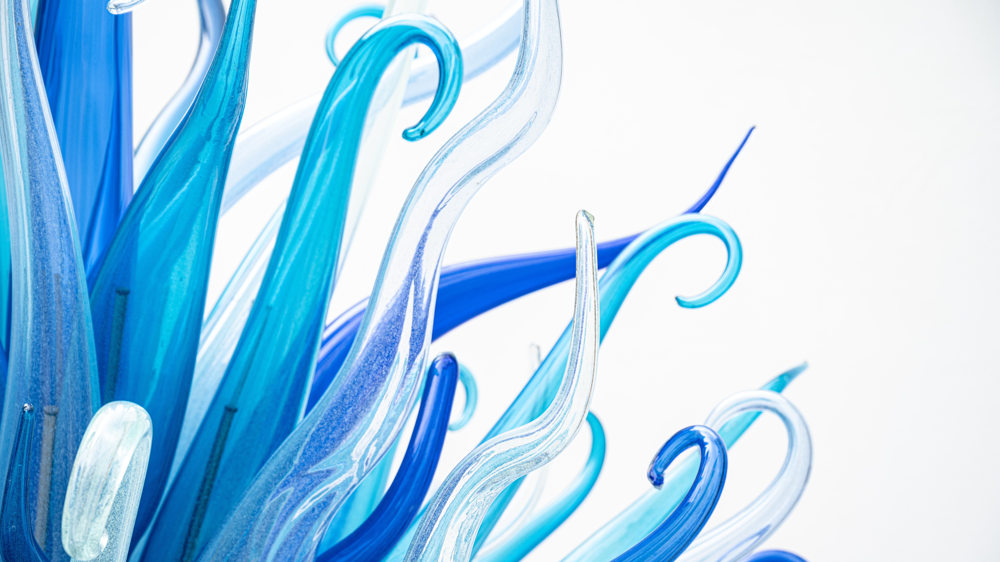
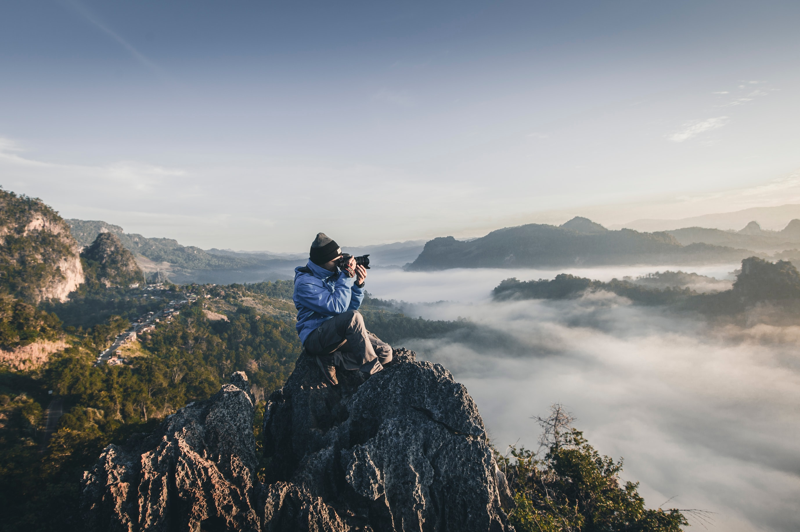

<!--
- add outline for the page (TOC)
- add more feature images for sections towards the end
- add more info to writing (or refer to the draft)
- check grammar
-->

# content production 
Content producers can be in charge of all stages of the [APM](project-management.md):
1. defining the goals
2. designing a suitable workflow 
3. developing the content e.g. by creating a podcast, designing a logo, writing text, finding or taking photographs, etc.  
4. asking for feedback from professionals on the drafts (works in progress)
5. publishing and disseminating the finished content (don't forget to contextualise)

*Who is the content producer for your website?*

<br><br>

<br><br>

This page outlines 
1. types of contents
2. types of materials 
3. take or make materials?
4. materials and content in some more detail
5. summary

<br><br>

## 1. content types
On a website, you can publish content focusing on
- still images e.g. a [photo-reportage](https://bcmi.khofstadter.com/firstsite-clip-sound-demo/) 
- audio e.g. a [podcasts](https://songexploder.net/) or [music](https://khofstadter.com/secret-place-and-remixes/)
- video e.g. a [short film](http://www.simonrpayne.co.uk/pages/videos/may.php)
- text e.g. an [article](https://consilienceproject.org/education-crisis/) or [programming code](https://docs.github.com/en/github/writing-on-github/getting-started-with-writing-and-formatting-on-github/basic-writing-and-formatting-syntax)

Your content (e.g. a web page) could [mix up](https://khofstadter.com/secret-place-hci/) these modalities in different ratios - whatever you think best suits your 'storytelling'.

*What do the following quotes mean, how could you rephrase them?*

>A picture is worth a thousand words.

> The sound and music are 50% of the entertainment in a movie. ~G. Lucas

> There are things in the book you could never do in a movie. ~ Noah Hathaway

<br><br>

## 2. materials

 photo by <a href="https://unsplash.com/@oksdesign?utm_source=unsplash&utm_medium=referral&utm_content=creditCopyText">Oxana Melis</a> on <a href="https://unsplash.com/@oksdesign?utm_source=unsplash&utm_medium=referral&utm_content=creditCopyText">Unsplash</a>

<br>

When creating content for your website, you could consider the following materials

1. still images e.g. 
   - [photography](https://unsplash.com/)
   - [computer graphics](https://www.freepik.com/vectors/graphics)
   - diagrams
   - could be used e.g. for  
     - making logos and [favicons](https://favicon.io/)
     - embedding feature/header images on the top of a page
     - embedding between text
     - in a videos

2. audio e.g. 
   - [sound recordings](https://freesound.org/)
   - [sound effects](https://mixkit.co/free-sound-effects/)
   - [music](https://www.silvermansound.com/free-music)
   - could be used e.g. 
     - podcasts
     - videos
     - web design with sound e.g. [rwatgg](https://rwatgg.com/) more [here](https://line25.com/inspiration/websites-background-music-sounds)

3. moving images e.g. 
   - [films](https://www.pexels.com/search/videos/construction/) (movies) made with cameras
   - [computer generated animations](https://www.videvo.net/free-motion-graphics/)
    - dynamic content e.g. [made with computer code](https://cs.nyu.edu/~kapp/cs101/processing_on_the_web/)


4. text e.g. 
   - [poetry](https://ttc.tasuki.org/)
   - [prose](https://loremipsum.io/generator/)
   - [quotes](https://www.entrepreneur.com/article/247213/)
   - computer code e.g. 

```
if ( students.happiness == true ) {
    kris = kris.happy
}
else {
    kris = kris.unhappy
}
```

<br><br><br>

 photos by <a href="https://unsplash.com/@nate_dumlao?utm_source=unsplash&utm_medium=referral&utm_content=creditCopyText">Nathan Dumlao</a> and <a href="https://unsplash.com/@kellysikkema?utm_source=unsplash&utm_medium=referral&utm_content=creditCopyText">Kelly Sikkema</a> on <a href="https://unsplash.com/s/photos/buying?utm_source=unsplash&utm_medium=referral&utm_content=creditCopyText">Unsplash</a><br>

## 3. take or make materials
Where to get these source materials from?

1. take it (free or paid)
2. make it i.e. DIY  

<br>

### 1. take it
Free and paid materials can have different requirements regarding
- attribution e.g. regarding private/commercial use or whether you need to credit the creator or not
- repurposing e.g. whether you can amend the source material or not
- stock libraries can list 
  - free and paid materials e.g. [Unsplash](https://unsplash.com/images)
  - only paid materials e.g. [Envato](https://studio.envato.com/)
  - only free materials e.g. [Freesound Project](https://freesound.org/)

<br>

Examples of free images in use:
- the images above on this file were all taken for free from Unsplash
   - the first image is used in its original form
   - the second image is a collage of three photos (modification allowed by [Unplash license](https://unsplash.com/license))
   - although it wasn't required, I gave credit to the photographers, maybe because I like when [my photos are credited](http://www.ludions.com/projects/lichens/) as well

more info on using free materials:
- https://creativecommons.org/
- http://www.differencebetween.net/business/difference-between-creative-commons-and-public-domain/

<br>

### 2. make it
To make your own material you can 
1. repurpose/reuse/amend free material (check licence) e.g. [poster](https://khofstadter.com/c/) e.g. [swimming music](https://khofstadter.com/swimming/)
2. start from scratch e.g.artwork and sound synthesis of [flow](https://khofstadter.com/flow-in-metamorphosis/)

<br><br><br>

## materials and content in more detail

### 1. still images
  - computer graphics (vectors or pixels)
  - photography (pixels)

<br><br>

<br><br>

<br><br>
- https://duckduckgo.com/?q=pixel+vs+vector
- main advantages:
  - pixels e.g. photos can provide more depth/detail
  - vector graphics e.g. logos are easily scalable

<br>

#### sources for taking
- https://unsplash.com/images/stock
- https://www.vecteezy.com/free-vector/vector
- more? Search for 'free photography', 'free images' or 'free vector images', 'photo stock library' etc.
- you can also ask people on [Flickr](https://khofstadter.com/if-only/), [Behance](https://khofstadter.com/deeper/) whether you could use their images
- remember to check the required attributions and how you can use (repurpose) the image

<br>

#### hardware/software for making
1. pixel work
  
> "The best camera is the one you have." 
- [*is it?*](https://www.lightstalking.com/best-camera-one-with-you/)
- consider light and composition first (more tips [here](https://www.lightstalking.com/best-camera-one-with-you/))
- if you can, shoot in RAW format to allow room for editing
- you can do serious work with [Gimp](https://www.gimp.org/) (a free [Photoshop](https://www.adobe.com/uk/products/photoshop.html) alternative)
- search for 'Photoshop alternatives'

<br>

2. vector work 
- you can do serious work with [Inkscape](https://inkscape.org/) (a free [Illustrator](https://www.adobe.com/uk/products/illustrator.html) alternative)
- search for 'Illustrator alternatives'

<br>

*How could your website benefit from still images?*

<br><br>

### 2. audio
materials:
- sound recordings
- sound effects
- music

content:
- podcasts
- music

<br>

#### types of podcasts
1. interview or presentation recordings
   - attention is paid on people talking
   - organic narrative
   - example:
     - https://rebelwisdom.podbean.com/
     - https://podcast.app/eckhart-tolle-essential-teachings-p687019/
  - sometimes it's the audio-only version of the original video format

2. storytelling with mixed material e.g. sound design and music, narration, interview clips
   - more artistic
   - edited narrative
   - examples:
      - [Trickster The Many Lives of Carlos Castaneda](https://tricksterpodcast.com/)
      - [Good In Theory](https://goodintheorypod.com/)
      - [Song Exploder](https://songexploder.net/)

<br>

#### microphones/speakers/headphones
- for quality recordings, use a condenser mic ([not a dynamic mic](https://duckduckgo.com/?q=condenser+vs+dynamic+mic))
- isolate noises when recording as much as possible (unless they are part of your soundscape e.g. your storytelling)
- record in high sample rate
- use quality headphones/speakers (called monitors) when editing audio
- show Zoom H1, binaural mic, gooseneck, windshield, jack cable 

<br>

#### software
production stages:
  1. recording/sound design/music composition
  2. editing
  3. mixing
  4. mastering
- big productions have different people for each of these stages, but can be done by one person as well
- stages can be done in one software e.g. Digital Audio Workstation e.g. like [Reaper](https://www.reaper.fm/), [Pro Tools](https://www.avid.com/pro-tools), [Logic Pro](https://apps.apple.com/gb/app/logic-pro/id634148309?mt=12)
- however, sometimes specific software/hardware is used for specific stages e.g. recording can be done with [portable recorders on SSD cards](https://www.zoom.co.jp/products/handy-recorder/h1-handy-recorder) or straight on the computer's HDD in a studio
- consider panning (mono vs stereo)

<br>

#### sources for taking audio
  - https://freesound.org/
  - more? search for 'audio stock libraries', 'free audio samples', 'free music', 'public domain music', etc. 

<br>
    
*How could your website benefit from audio materials/content?*

<br><br>

## 3. moving images
source material:
- films (movie clips made with a camera)
- computer-generated animation clips
- computer screen recordings (screencasts)
- still images
- audio 

<br>

### moving image type
1. simple interview or presentation recordings e.g. [a lecture's archive](https://www.youtube.com/user/johnvervaeke/videos) - similar to podcast type 1
2. storytelling with mixed material e.g. [sound design, music and narration, graphic design](https://www.youtube.com/c/theschooloflifetv/videos) - similar to podcast type 2
3. screencast e.g. [demonstrating the use of a specific software](https://www.youtube.com/watch?v=yrQSf8GSCXA&list=PLRr9g36OjY6-xnDwUx4itRlh-xrlsszNZ)
4. short film/animation (documentary or artistic/dramatised)

<br>

#### production stages
- similar to the audio production stages above
1. film recordings i.e. shootings / graphics rendering
2. editing e.g. arrangement of clips, linking audio and visuals
3. mixing and mastering (fine tuning audio and sound e.g. colour tuning, noise reduction, surround spatialisation)

<br>

#### hardware/software
to record films:
- smartphones, camcorders, video cameras, webcams (chosen according to project's needs)

to create animations:
- search for '[compare animation software](https://duckduckgo.com/?q=compare+animation+software&t=brave&ia=web)' 

to record audio:
- inbuilt or external microphones (for better quality use external, condenser microphones)

to edit videos: 
- [Premier](https://www.adobe.com/uk/products/premiere.html), [iMovie](https://www.apple.com/uk/imovie/), [Final Cut Pro](https://www.apple.com/uk/final-cut-pro/), [DaVinci Resolve](https://www.blackmagicdesign.com/products/davinciresolve/) - available on lab PCs,  ... search for 'video editing software'

to edit audio:
- most video editing software provide you with good audio editing functions
- but, you can export the audio from the final video and edit/mix/master in a software specialised for audio work

to make screenrecordings/screencasts:  

- [Screencast-O-Matic](https://screencast-o-matic.com/) (available on lab PCs)
  - [tutorial](https://www.youtube.com/watch?v=LAg4_eFITNc)
  - can't edit with the free version nor record computer audio but offers screen+webcam even without making an account
  - limited to 15 minutes
  
- [Open Broadcaster Software](https://obsproject.com/)  (available on lab PCs)
  - [tutorial](https://youtu.be/QKmrDUJFRkM)
  - does not seem to be a good editing tool, but it's free and you can mix desktop + webcam and export in a variety of formats

- more? search for 'screencast software comparison'


#### thoughts
- record in high definition if you have space 
- before you start working with a software, read many articles comparing alternatives
- as with photography, consider light and composition first
- I can demonstrate the use of software available on the lab PCs if needed (perhaps at the end of this seminar)

<br><br><br>

*What are the pros and cons of taking or making linked to visual and audio materials?*

<br><br><br>

### 4. text
- e.g. blog post, journal paper, book etc. 
#### software
- Word, Markdown, etc. 
#### referencing
- experiment with referencing apps e.g [JabRef](https://www.jabref.org/)
#### grammar
- before asking for feedback, check with Grammarly, ProWriting Aid, etc. 

#### my flow
1. write in VSC
2. check with SpellRight extension
3. copy/paste to Grammarly
4. copy/paste to ProWriting
5. copy/paste to Hemingway (maybe)
6. copy/paste to Word (maybe)
7. can someone give me feedback (a native speaker or someone whose English is really good?)
8. submit/publish

<br><br><br>

## summery
- use a project management method for your project
- take it or make it
- use paid vs free software
- do it all or delegate tasks (if you can)
- less is more (e.g. simple transitions in video editing), especially if your raw materials are good
- try start with good raw materials instead of trying to sort out issues later with software
- record raw files and archive them for later
- keep assets e.g. audio/video/text files for one project together i.e. organised in one folder
- have a convention for naming and organising your files
