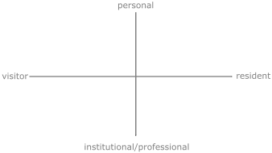

<!-- #todo
- web or Web
-->
# digital identities
## table of contents
- [generations](#generations) 
- [visitors and residents](#visitors-and-residents)   
  - [introduction](#introduction)  
  - [credibility](#credibility)  
  - [open practice](#open-practice)  
- [assignment reminder](#assignment-reminder)
- [additional](#additional)

## generations
<!-- #todo embed a gantt chart -->
- overview: https://youtu.be/TtIojDWOsgg
- the silent generation (traditionalists)  b.1945
  - value hard work, don't like to be wasteful, respect authority/elders  
- baby boomers b.1946-64
  - counterculture, started out to be liberal, now more conservative
- gen X b.1965-79
  - both parents working, more peer orientated, music helps define their identity
- gen Y (millenials) b.1980-95
  - more technology, more group oriented (some say more selfish, entititled, lazy, etc.)
- gen z (centenials) b.1996-present
  - relationshipt to technology depends whether parents are gen x or gen y
  - strong relationship to technology
  - most similarities to millenials
- group shares collective experiences

 

## visitors and residents

> Visitors and Residents (V&R) is a simple way of describing the range of ways individuals can engage with the Web. 
(White et al. http://daveowhite.com/vandr/) 

### introduction
https://youtu.be/sPOG3iThmRI

- the V&R map can quantify our engagement with technology more accurately than [Marc Prensky](https://www.marcprensky.com/)'s Digital Natives and Digital Immigrants method
- the V&R method uses a 2D coordinate system to quantify our engagement with technology/web

  
<strong>V&R map (plain) </strong> You can download this image in .svg format from the repository's `assets/img` folder.
  

- the V&R map helps all ages (not just old people) and people with low technical skills to use the web efficiently
- it is based on people's motivation to engage with the web and has two modes, visitor and resident modes, and is further refined by whether we engage in an activity in a personal or an institutional (professional) manner
- visitor modes: activities where **we don't leave a social trace behind** e.g. searching/reading information on the Web, watching videos, shopping, paying our bills. (Remember that search engines could store your search history. This search history is just not available publicly). And also think about what information websites crawl from you when you visit them.)
- resident modes: activities where we are present with other people and **we leave a social trace behind** (stays online after we leave the internet) e.g. by creating content or commenting on other people's content on online platforms (websites, social media). As these activities are public, they can be linked to our (digital) identities and therefore we should be careful when we use the web in this mode. (We should be careful when we use our visitor modes as well of course.)
- examples or personal engagements are e.g. using social media or emails to communicate with friends and family about personal matters
- examples of institutional activities are e.g. disseminating or discussing ideas as a worker (and perhaps as a student in higher eduction)
- V&R map examples: http://daveowhite.com/vandr/vr-mapping/

  

### credibility
https://youtu.be/kO569eknM6U

- before the web, institutionally reviewed resources were made available on paper, which, as this was expensive, meant that only experts could publish
- in contrast, the Web more recently provides an inexpensive method to share information with a potentially large audience without the institutional gatekeepers

> In the only environment where curation is by algorithm and not by librarian, convenience and relevance often outstrip traditional notions of credibility and authority. The Web brings into question what it means for a source of information to be legitimate, and it highlights the trust we place in the form and provenance of those sources.

- traditional information (e.g. books) and information on the Web (e.g. a blog post) use different methods to gain attention and credibility: 
  - traditional (established): validated by established institutions e.g. universities, publishing houses and know experts (promoted by institutions)
  - Web (new/emerging): search engines, likes, followers, views, comments (promoted mainly by individuals)

- using the Web to source information is convenient however, it might not provide the most accurate information about a specific subject

- earlier, students published their first work after their PhDs. Today the Web allows us to start develop our professional identity before finishing our doctoral research e.g. by expressing our opinions about others' work openly and publishing our own work on our websites or relevant platforms e.g. videos on Vimeo, articles on Medium, music on SoundCloud, photos on Flickr, graphic design on Behance, software on GitHub, etc.

### discuss
- should educators in higher education be active online e.g. share their teaching resources on the Web and engage with learners who did not formally enrol in a module?
- what is the future of education? <!-- what do students get for paying their high fees? -->
- shall students' learning rely entirely on the processes of formal education; lectures/workshops primarily using established forms of resources (e.g. academic journals) and assignments (e.g. essays or portfolios) or should their learning be more agile and incorporate the use of information on the Web (e.g. blog articles) and feedback on their works outside their workshops i.e. shall they seek feedback from people on discipline related forums?

- we should not expect students to know how to use institutional identities in resident modes efficiently? But **they should be encouraged** to develop this practice. 

Remember, for the CS220 AU assignment you
  - should experiment with private and public GitHub repositories
  - can submit your reflection included in your public GitHub repository (which everyone can see online) or on FASER instead (you choose)
  - can choose between developing a website for your professional identity tied to your 'real name' or a website linked to one of your projects which does not have to be tied to your 'real name' but to a brand name instead e.g. 'Saving Trees In Colchester' or 'I help you understand the world', etc. 

  

### open practice
https://youtu.be/1X0g2OvSdWc

- students are comfortable sharing information about their personal lives online, but less comfortable sharing information about their developing professional practices "especially if this might open them up to criticism or reveal mistakes and failings"
- the audience of traditional publishing is 
  - targeted i.e. if you publish in a journal on biology you will have primarily biologist reading your work
  - "usually is at a safe distance" i.e. if they criticise work they will do it in writing in a paper they publish (unless you present at a conference - some people can be harsh)
- the audience when publishing on the Web
  - (while being targeted) can be unlimited as well
  - can give you quick feedback linked to their real or not real identities
 - it might be better to consider work published online as unfinished, something that can start discussions
 - a powerful feature of open practice using the Web is the access to feedback from individuals or networks who are beyond the classroom
 - White believes 'that making the process of learning more visible and collaborative online challenges students to become relevant members of their discipline or academic community' (although does not suggest this for all subjects)
 - students should have their own private groups where they can express themselves without being afraid of being monitored
 - our main resident identities on the Web should probably not be a mix of personal and professional/institutional (hint: be personal in private groups and professional openly)

 > All criticism is a form of autobiography. (Oscar Wilde)

> Insecurity is an ugly thing. It makes you hate people that you don’t even know. (Heather)

### discuss
- how could someone's professional identity be linked to her private life?
- shall students start sharing information about their practice/research after finishing their degrees or before?
- could some of you set up a forum where you can openly discuss ideas/issues openly which are not monitored (by me or the university)?
- how can you continue the sentence "As education moves towards incorporating the use of the Web, ... "

 

## assignment reminder
1. reflection on your digital identity using two V&R maps (present and future)
2. a website linked to your professional identity (this can linked to your real name or one of your project's which does not have to be linked to your real name)

 

## summery
- it's not just old people who need to learn how to use the Web. It's complicated and complex <!-- #todo link RW video --> and therefore all ages should educate themselves.
- we need to be careful with the information we engage with online as it leaves a digital footprint e.g. your drunk videos might stay on Facebook forever
- it's a good idea to start working on your professional(institutional) identity while studying but we should make sure that we are confortable with where and how much of our ideas/questions are share publically (learn to use both, private and public notetaking/publishing tools)

 

## additional
### discuss
- what do you know about data mining?
- use Brave Browser for a while to see what websites are trying to access from your (your computer)
- do I know how Tech Giants e.g. Google and Facebook use my data?
- what is our digital footprint?

 

### resources
- clarify millennials vs gen Z: https://youtu.be/aqdm6aBUZII
- https://www.bbc.co.uk/bitesize/articles/zf8j92p
- https://www.thesocialdilemma.com/
- https://www.psychologytoday.com/us/blog/anger-in-the-age-entitlement/201404/whats-wrong-criticism
- Digital Native (1982-94) vs Digital Immigrant Model (Mark Prensky 2001)
- https://www.pewresearch.org/internet/2014/03/11/digital-life-in-2025/
- https://youtu.be/Bg3a5f107Jc (Artfilm by Douglas Coupland, exploring how the use of technology changes culture in the early 1990s.)
- https://www.vpnmentor.com/research/whos-watching-you/#/?filter=thirdParty
- https://youtu.be/fifVuhgvQQ8
- https://monitor.firefox.com/
