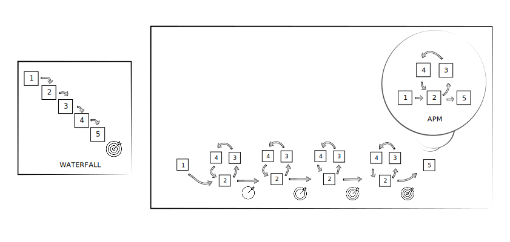
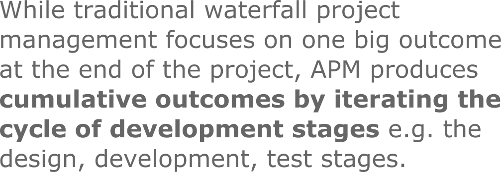

# project management
## Agile Project Management (APM)

  

Consider managing your assignment with APM. 

Here an outline of its five stages:

### 1. goals stage
- identify a problem and potential solutions
- use initial literature review and discussions to define the problem and the potential solutions
- in academic terms, this stage is linked to writing the research question (the problem) and the objectives (the objectives are ways/methods that you think can answer the research question, provide solutions)
- this stage is based on your own idea/problem **and your research on how others have thought about the idea/problem before you** e.g. by using or developing a specific tool/method(ology)

*What are your goals in the CS220 assignment i.e. what problems are you trying to solve with (1) your di-reflection and (2) your website?*

  

  

### 2. design stage
- further development of objectives (the potential solutions) with a (somewhat) detailed breakdown on how you will use or develop tools to answer your research question
  - useful tools: 
    - a thorough TODO list
    - a timeline with deadlines using a [Guntt chart](https://www.gantt.com/) e.g. https://bcmi.khofstadter.com/start-of-the-research/ 

*What tools can you use to design the narrative of your di-identity essay?* <!-- V&R map, my di-identity template -->

*What tools can you use to design the layout of your website?* <!-- drawing on a simple notebook and simple markdown language -->

  

  

### 3. development stage
- depending on the project, this stage can have more literature review e.g. gathering data to compare/analyse/critic/repurpose/re-contextualise, etc. 
- the stage, where the actual 'work', the 'art' is growing e.g. by
  - writing text e.g. books, journal articles, blog posts
  - producing audio e.g. a podcast series, sound design and music, interviews, etc. 
  - producing video e.g. a vlog with screencasts, short film documentaries, art films, music videos 

*Can we readdress previous stages, the goals and the design stages?* <!-- yes, this is why it's called agile -->

*How important is it to have clear goals and a detailed design?* <!-- the clearer the better to streamline production -->

  

  

### 4. test stage
- seeking feedback from other people e.g. clients, potential clients, [your minimum viable audience](https://seths.blog/2019/03/the-minimum-viable-audience-2/), your colleagues, professionals e.g. with
  - quantitative and qualitative surveys

*How is this test stage implemented in your assignment?* <!-- self and peer assessment -->

  

  

### 5. deployment stage
- here we publish i.e. distribute, disseminate, share and advertise our work 
- important to contextualise for different channels (synchronise your work with your target audience's thinking e.g. by using context specific vocabulary)
- your portfolio website can have the full project or a brief outline with an external hyperlink e.g. as seen on https://khofstadter.com/

<!--
- no need to know everything before you start/ship
- learn to fail, don't make it too personal i.e. distance your emotions from it perhaps by not being too attached to expected outcomes
- if you don't know what you want, start with what you don't want e.g. by making a list
- write content that is easy to change e.g. use raw text
- organise data chronologically, with EU data format and by using taxonomy e.g. categories i.e. groups/themes/types and tags - you could consider them as keywords as well 

## blogging and social media
- make once, share link, image and abstract (or subtitle) everywhere else
- traffic to point back to your website 

## 5-10 years plan
- check a software that can make you older,and than use this to prepare you personal development plan

## working with music
- don't listen to music with lyrics
- fit the tempo to your work
- if you are writing, try something minimal (fast or slow, but without many changes - make it gradually change not instantly)
- you could watch tutorial videos and listen to the narration and listen to your music in the background with lower volume (e.g. two youtube videos open, one music, one lecture)
-->

   

## project management tools
My preferred tool is a the following combo: 
### GitHub, MarkDown and Visual Studio Code (VSC)
The [github-and-markdown.md](github-and-markdown.md) file outlines this tool. 

If you want to use the [Zettlekasten method](https://youtu.be/rOSZOCoqOo8) to organise your notes, you can use a VSC extension called [Foam](https://foambubble.github.io/foam/) for free with GitHub, Markdown and VSC. 
  
### alternatives
- [Trello](https://trello.com/)
- [Workflowly](https://workflowy.com/)
- [Roam Research](https://roamresearch.com/) - Zettlekasten method
- [Obsidian](https://obsidian.md/) - Zettlekasten method
- [Evernote](https://evernote.com/)
- [Notion](https://www.notion.so/)
- physical notebook + 4 colour BIC pen

<!--
### Foam issue on GitHub
- Foam's known issue: it does not work well when using the GitHub Repositories extension, because the one the essential extensions used for Foam, Markdown All in One does not work with virtual workspaces. So, the current idea is to use Foam with GitHub Desktop. To monitor issue: https://github.com/yzhang-gh/vscode-markdown/issues/996
  -->

 

## note taking ideas
### listening to podcasts
- when listening to a podcast, you can walk or lay down and keep you eyes shut, perhaps do the washing up or something very manual/repetetive
- to take notes, you could pause your podcast player and instead of taking notes in writing (on an app or in a physical notebook) - you could use an audio recorded app 
- this could help you summerise what you've learnt in your own words, which note can later . This can help you in your essay when you need to paraphrase something. 

## timekeeping ideas
- set some time aside for your work and only concentrate on your work e.g. switch of notifications on your devices, don't check Facebook Messages or emails, don't listen to distracting music, etc. 
- track your time e.g. work for 1 hour and make sure you understand that your brain needs to warm up (to create some kind of momentum) and also leave time for putting things in your log and your TODO list