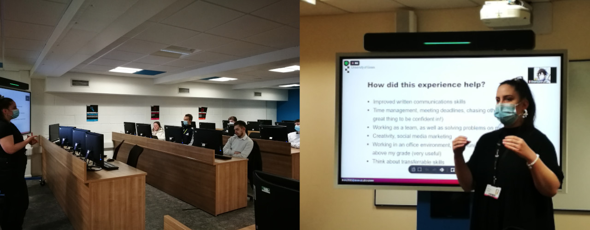
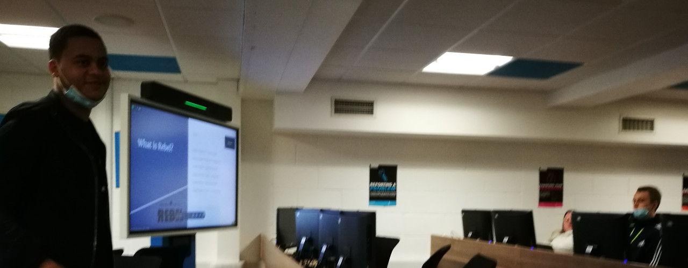
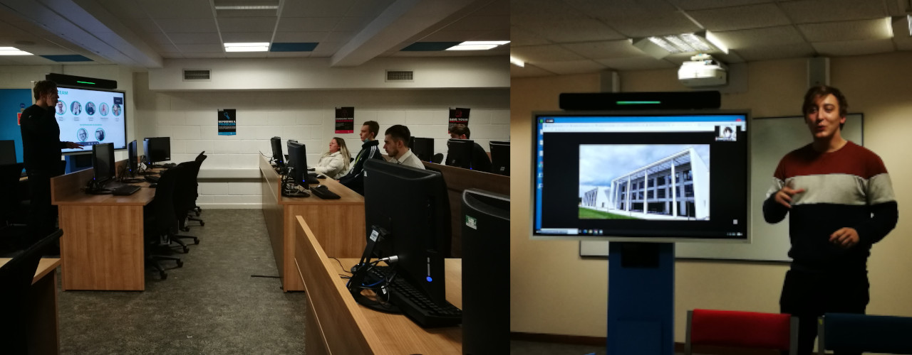

# syllabus

w1 welcome week   
w2 [module introduction and digital identities](#w2-module-introduction-and-digital-identities)  
w3 [GitHub and Visual Studio Code](#w3-github-and-visual-studio-code)  
w4 [websites and troubleshooting](#w4-websites-and-troubleshooting)  
w5 [project management](#w5-project-management)  
w6 [content production](#w6-content-production)  
w7 [presentations](#w7-presentations)  
w8 [reading week](#w8-reading-week)  
w9-10-11 [workshops](#w9-10-11-workshops)  

This outline is subject to change based on our progress.

   

## w2 module introduction and digital identities

- intro by Paula / AU clarification
- see DAVE and your PC

_Everyone logged in to Moodle?_

_Did you find the link to this GitHub repository?_

- you are free to leave the room anytime you feel you need some fresh air/the toilet, etc.
- we will try to have a 10 min break in the middle

_Have you received my email last week? Who wants to introduce him/herself?_
<!-- make sure they are not under pressure, as there might not by much they have been working on -->

I can go first:

> Hello! My name is Krisztián Hofstädter, aka tEdör. I am a creative technologist working as a researcher, lecturer, freelancer, and artist. My primary interests are brain-computer music interfacing linked to meditation, electronic dance music and animal rights. I was born in Hungary and have been living in the U.K. since 2005. You can find most of my work on my personal website https://khofstadter.com/

 

### introduction and theory

- quick intro to the syllabus
- module introduction with the [`README.md`](README.md) file
- 10 min break? (who has a class after this?)
- [digital identities](digital-identities.md)

 

### is this module for you?

In essence, the module can help you

- develop your engagement with the Web and your professional identity
- understand basic web design and make a free (fast) website
- with feedback from me and your class on your progress

 

### homework

- please send me your brief introductions via email by next week’s seminar
- start making your first V&R map on paper or in software (you can use the .svg file in the assets folder) - check the examples on White’s [website](http://daveowhite.com/vandr/vr-mapping/)
- explore links in the [digital identities](digital-identities.md) file
- explore the [di-identities](https://krisztian-hofstadter-tedor.github.io/CS220-AU-portfolio/di-reflection.html) file in the CS220 portfolio template repository. It could give you ideas for your writing. (We will check this repository together next week.)
- consider creating an online group for yourself where you can discuss module related questions without me/university monitoring it

   

## w3 GitHub and Visual Studio Code

### discuss progress / clarifications
- _would you like to present your progress to your class?_
- _has anyone joined the Facebook group?_
- _do you need clarification on the `di-identity` assignment?_
- you should only use the Zoom webinars if your [request to study remotely](https://www.essex.ac.uk/student/covid-19/remote-study) was granted
- there is no official reading list, but there are many links and references in the files on this repository that I would encourage you to check
- if you need help with your English language, please visit [this page](https://www.essex.ac.uk/departments/language-and-linguistics/english-classes-for-dependants)

 

### GitHub
We will
- sign up to GitHub and create two repositories (a private and a public one)
- examine your new public repository, your own copy of the [digital portfolio template](https://github.com/krisztian-hofstadter-tedor/CS220-AU-portfolio)
- experiment with basic Markdown syntax in the GitHub editor e.g. headings, lists, bold, italics, hyperlinks
- start adding entries/ideas to the ‘log’ and the ‘TODO’ headings in your portfolios
Please open the [`github-and-markdown.md`](github-and-markdown.md) file. I will walk you through the setup.

 

### Visual Studio Code
You can find a short screen cast where I introduce this software [here](https://youtu.be/taFSpPeHs0o). If you need any help with setup, please let me know. 

 

### homework ideas
- start using your private and public repositories and get familiar with Markdown language
- make sure you use a private repository for your private notes (you can refine your writing in private and then move it to a public repository when/if ready)
- try [Brave Browser](https://brave.com/) to see what data websites are trying to crawl from you (data mining)
- carry on working on your di-identity reflection (the essay)

   

## w4 websites and troubleshooting

### discuss progress / clarifications
- welcome Francesca and Maria - did you manage to catch up with the video I sent you?
- _would you like to present your progress with your portfolio overview e.g. link + TODO lists?_
- _do you have questions regarding your assignment?_
- if your GitHub account name is not your student number, [could you please amend it](https://youtu.be/5GQEf_5PSUs)?
- you don’t need to fork the ‘CS220-AU-navigating-the-digital-world’ repo (it might confuse things)
- please change the settings of your ‘notes’ repository to private if you haven’t yet
- _did anyone check my [VSC](https://youtu.be/taFSpPeHs0o) video_? _Is anyone planning to use it? Do you need more info?_

 

### websites
The [`websites.md`](websites.md) file outlines
- some reasons to have a website
- two types of website builders: 
    1. static site generators (SSGs)
    2. web content management systems (WCMSs)
- the difference between textual and visual programming
- free WCMSs, with attention to WordPress
- custom domains
- how my website has changed over the years
- GitHub Pages (a free SSG)

 

### Your GitHub Pages website
- turn your ‘CS220-AU-portfolio’ repository into a GitHub Pages website in the repository’s `Settings/Pages` 
- add the website’s URL to the repository’s sidebar
- make some changes to the `index.md` file and wait for these changes to happen (sometimes takes seconds, sometimes minutes - which is one disadvantage when working on a GitHub Pages website in the GitHub editor using an internet browser). 

Some examples of changes you could make:
- replace my brief introduction with your brief introduction
- drop a small image file (JPG or PNG) to your repository’s `assets/img` folder and embed it in your `index.md` file
- change some hyperlinks
- embed another YouTube video

 

### discuss
- _why is it good to have a website?_
- _how can it support your professional/institutional identity?_
- _what can you add to your website?_ 
    - Some ideas:
        - full CV / parts of your CV
        - project outlines, reports
        - blog e.g. using audio-video or/and textual content or just text e.g. your di-identity essay
        - links to social media profiles e.g LinkedIn
        - affiliations with organisations/institutions/clubs, etc. 
        - can you think of anything else?
- _what are efficient ways to use a website with social media accounts?_
- _how do I decide whether an SSG or a WCMS is best for a website?_
- _do I need new skills or do I have the money to pay someone to do the job for me? What are the advantages/disadvantages of these two options?_
- _why is it good to keep my information in raw text format i.e. as simple as possible?_
- _what are the advantages of LinkedIn over other social platforms?_

 

### troubleshooting
- [troubleshooting.md](troubleshooting.md)

 

### homework ideas
- consider how your website could benefit from audio-visual content
- experiment with adding content to your `index.md` file
- compare [Markdown and HTML](https://codingnconcepts.com/markdown/markdown-vs-html/)
- progress with your `di-identity` assignment
- set up your LinkedIn account

   

## w5 project management
### discuss progress
- _do you have any questions about the assignment?_
- _what are the main tasks you are working on?_
- _have you considered how your website could benefit from audio-visual content?_
- _did you set up a [LinkedIn](https://www.linkedin.com/) account?_
- [your progress](https://github.com/krisztian-hofstadter-tedor/CS220-AU-portfolio/network/members)

 

### website clarification with examples
1. short/simple project website
   - https://khofstadter.com/sonic-art (find submission examples)
2. complex/longer project website
   - https://bcmi.khofstadter.com/
3. portfolio website
   - can feature multiple projects/themes
   - https://khofstadter.com/ and https://storylabresearch.com/

*Do you plan to link your website to your real name or your 'non-real name' e.g. artist name, avatar?*

 

### project management
- [project-management.md](project-management.md)

 

### homework
- explore a variety of software for audio-video production
- progress with your assignment

   

## w6 content production
### discuss progress
- _do you have a partner for peer-assessment?_
- _do you have any questions regarding your assignment?_
- [your progress](https://github.com/krisztian-hofstadter-tedor/CS220-AU-portfolio/network/members)
- presentations next week (see below)
- *are you planning to do a presentation?*
- added some note taking and time keeping ideas to the end of the [project-management](project-management.md) file

 

### project in need of a website
#### Freestore Project
> Freestore is your one-stop shop that allows you to drop off stuff you don’t want anymore and pick up things you do want for FREE.
The project needs a website that
- record the progress of the project
- promotes the project
- interacts with students e.g. with request/donate feature
- perhaps embeds a Twitter Feed or Facebook Group with a hashtag e.g. #EssexFreestore for people to tweet pictures parting with their pre-loved things, great finds...
- next meeting at end of Nov, date TBC

 

### content production tools
- last week we discussed 
  - [types of websites](websites.md)
  - methods for [project management](project-management.md)
- this week we discuss ideas on
  - [content production](content-production.md)
for your website

 

### homework
- please find a partner for your peer-assessment
- carry on working on your assignments
- send me questions if you have any

   

## w7 presentations

- 11:00 - Krisztian: setup and outline of seminar
- 11:15 - Eszter (blogging while being a student)

 

- 11:45 - Thomas (content production for Essex REBEL)

 

- 12:15 - Krystian (Studio X and helping set up start-ups)

 

<!-- 
### Eszter Q/A
- is there anything similar to Frontrunners here at Essex?
- you did History - do you think other departments have blogs like yours as well?
- paid/unpaid work - you got paid - how can we balance or choose well?
- what was feedback from students?
- was there any way you could connect your articles/content with your assignment e.g. by referencing yourself?
- was it Wordpress you used? Have you used other website builders?
- writing email to lecturers - don't worry about asking questions, right?
- presentation skill - good idea to practice in class?
- could Marketing/the Essex student blog consider essays / shorter

### Thomas
- FrontRunner vs REBEL support: not paid, but access to cool equipment, introduction to a more rigorous workflow, constant feedback from team members, working with other students (not staff)
- good to be introduced to the complexity of content production e.g. what ethical issues need to check before publishing, ...
- feedback on each other's work
- need individual social people - are these influencers?
- are the accessible versions audio podcasts?
- what's the alternative to Grammarly in WordPress?
- contextualising 
  - writing style is tailored to the audience. 
  - learn how to talk to different people e.g. status, type of work
- the radio we hear in the shop is broadcast from your studios? 
- essay handed in as an article

### Krystian Q/A
- would they need training for using the technical equipment?
- do you help with presentation skills?
- how often do you award people i.e. how much money is there available per year?
- what ongoing student project do your support? Are there any that link back to their degrees the disciplines they study?

-->

 

## w8 reading week

 

## w9-10-11 workshops

### w9 Wed
- Christian's presentation
- Tom 12:30 REBEL presentation

 
