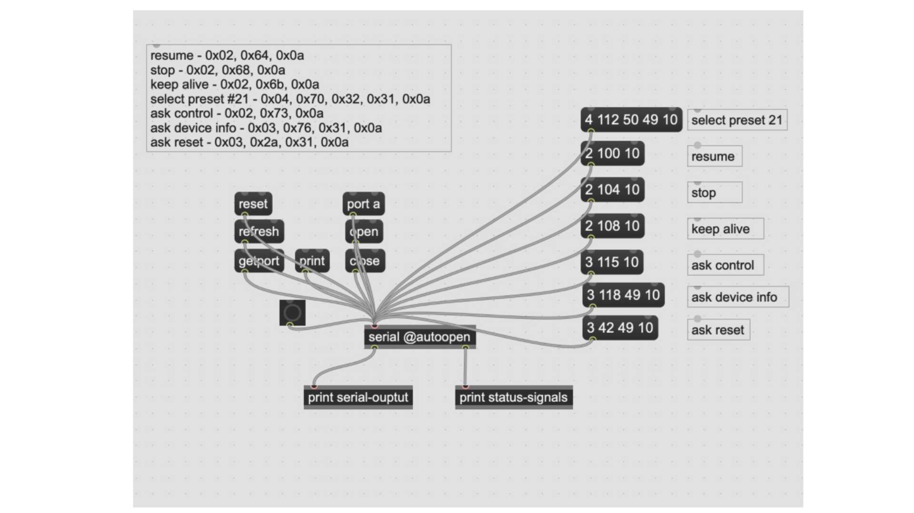
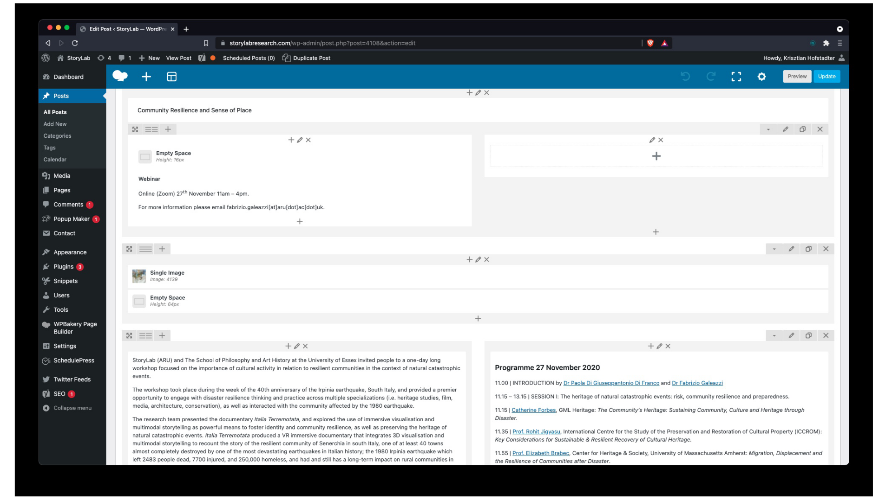
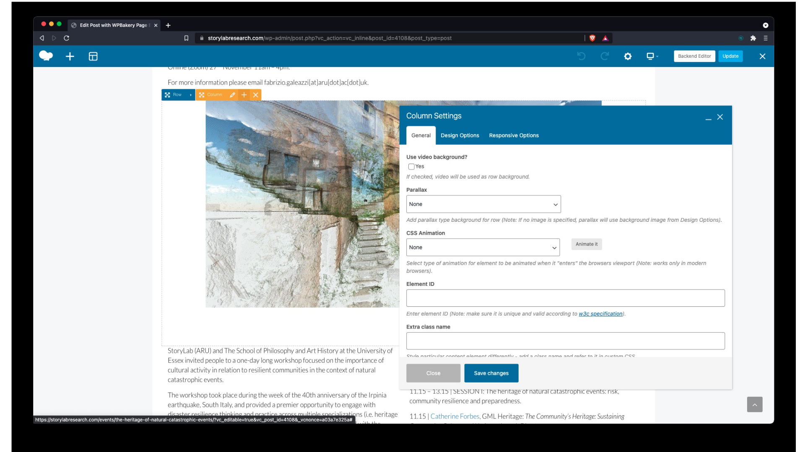

# websites

## why build a website?

You

- own the content

- can have full control over its functions and design

- can disseminate a URL to a specific page in different corners of the Web e.g. on social media platforms, forums, emails, etc.

- can give people an overview of your past and current work and provide an outlook e.g. to help seek collaborators

- can redesign it whenever you feel it needs a new feel (you can create a different feel for each page if you want)

- can add website skills to your CV e.g. web design, web hosting and programming

- ,with these new skills, can build websites for others

 

## website builders

There are two main types:

1. [static site generators](https://staticsitegenerators.net/) (SSG) e.g. [Jekyll](https://jekyllrb.com/) which is used with GitHub Pages when turning Markdown files into a website

2. [web content management systems](https://en.wikipedia.org/wiki/Web_content_management_system) (WCMS) e.g. [Wordpress](https://wordpress.org/), Wix, Squarespace and [other website builders](https://websitebuilder.org.uk/) with which it is easier to create more dynamic websites

- SSGs are usually free while WCMSs often have a monthly subscription fee

- both types have free and paid themes e.g. [here](https://jekyllthemes.io/) and [here](https://duckduckgo.com/?q=wordpress+themes&t=brave&ia=web)

- both types can use plugins to do a specific function. [SSG plugins e.g. [Jekyll plugins](http://www.jekyll-plugins.com/) are usually free, while plugins for WCMSs can vary e.g. while many of them are free, some can be expensive

- there are many more plugins for WCMSs than for SSGs (because more people use WCMSs than SSGs)

- SSGs, in general, need more textual programming skills while DSBs, in general, are more visual and therefore need less textual programming skills

 

### textual vs visual programming examples

SuperCollider (audio):

<!-- todo: change image to Markdown (left) and HTML (right) -->

Max (audio):

WordPress backend (WCMS):

WordPress frontend (WCMS):

 

### some free WCMSs

- https://youtu.be/myM1H_jAyzI

 

### Wordpress.com vs WordPress.org

- WordPress is an open-source WCMS available at WordPress.org

- the website WordPress.com is owned by a hosting company called Automattic, where you can set up the WordPress WCMS (not too technical)

- you can set up this WCMS with different hosting providers as well e.g. [TSOHOST](https://www.tsohost.com/) (which can be more technical, but maybe more economic e.g. if you own many websites)

- more info [here](https://wordpress.org/support/article/wordpress-vs-wordpress-com/)

 

### custom domain

- with free websites, you often get a long domain name containing the name of the company you set your website up with e.g.

  - https://krisztian-hofstadter-tedor.github.io/CS220-AU-navigating-the-digital-world/

  - https://mywebsite.wordpress.com

- if you want to have your own ‘custom domain’, register it with a domain registrar (which costs around £10/year)

  - https://github.com/krisztian-hofstadter-tedor/khofstadter.com is linked to the custom domain [https://khofstadter.com/](https://khofstadter.com) which I registered with [NameCheap](https://www.namecheap.com/) - this is a GitHub Pages website using Markdown, HTML, Jekyll and some other programming languages (costs around £10/year to run)

- I built the website [https://storylabresearch.com/](https://storylabresearch.com/) using WordPress, and are  hosing it with TSOHost, where its custom domain is registered as well (costs around £400/year to run; this cost includes a faster VPN server and an additinal extra security packages)

- websites built with other WCMSs would also [cost above £100/year](https://www.websitebuilderexpert.com/website-builders/comparisons/) to run

 

### my tedor.info to khofstadter.com

- [2013](https://web.archive.org/web/20130624224549/http://tedor.info/) with [Indexhibit](https://indexhibit.org/)

- [2018](https://web.archive.org/web/20181130174711/http://www.tedor.info/) with WordPress

- [2021](https://khofstadter.com/) with Jekyll and GithHub Pages

 

### Brief WordPress demo

- https://storylabresearch.com/admin (I need to log in)

 

### GitHub Pages

- [intro video](https://youtu.be/2MsN8gpT6jY)

- [documentation](https://docs.github.com/en/pages)

 

## SSG vs WCMS

- a static site generator pre-creates the webpages e.g. the Markdown files are converted into HTML files (instead of creating the page when someone visits a WordPress site)

- the data with the static site is stored in the website files with the WCMS the user data e.g. blog article, images, etc. are stored in a separate database file

- a static site loads much faster as the files are pre-created (and no database is used)

- the pre-creation of the webpages makes the site more secure as malicious code while loading the pages cannot be injected (or is more difficult to do)

- a good comparison: https://youtu.be/_NZJW7IoGR4

- main advantages of static site generator: fast, more secure

- main disadvantages: you need some coding experience

- you can add CMS to some static sites e.g. with [https://jamstack.org/](https://jamstack.org/) as demonstrated in [https://youtu.be/4wD00RT6d-g](https://youtu.be/4wD00RT6d-g)

 

## more resources

- [free website builders](https://youtu.be/myM1H_jAyzI)

- a [collection](https://github.com/collections/github-pages-examples) of nice GitHub Pages

- [colour psychology](https://www.verywellmind.com/color-psychology-2795824)

- https://marksheet.io/introduction.html

- https://www.flatfilecmslist.com/

- https://developers.google.com/web/fundamentals/

- https://devhints.io/jekyll

- https://ogp.me/

- https://moz.com/learn/seo/what-is-seo

- https://www.leadfeeder.com/blog/google-analytics-alternatives/

- https://talk.hyvor.com/blog/disqus-alternatives/

- https://www.codementor.io/
